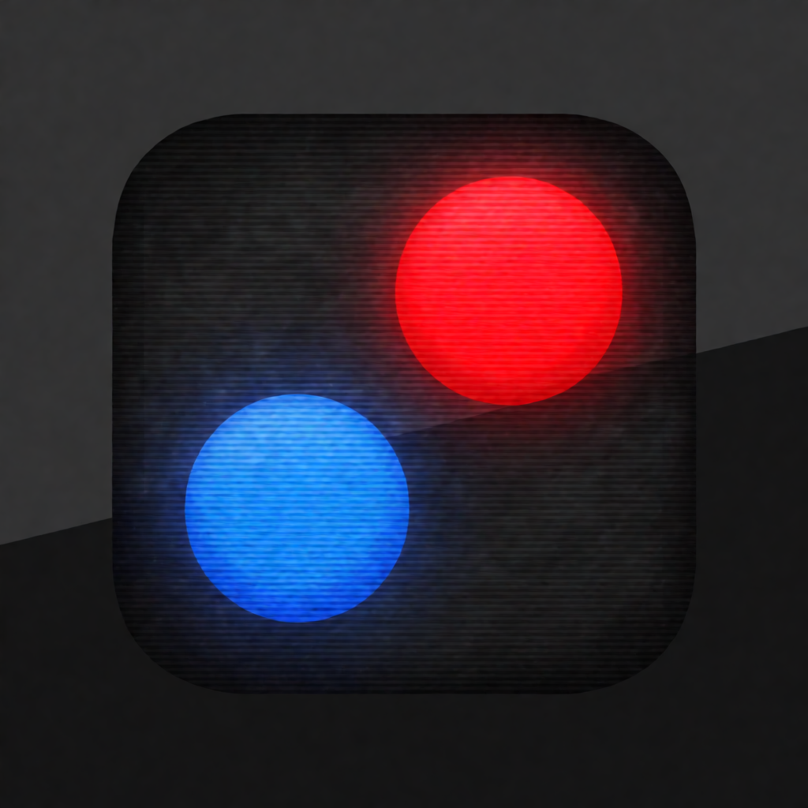
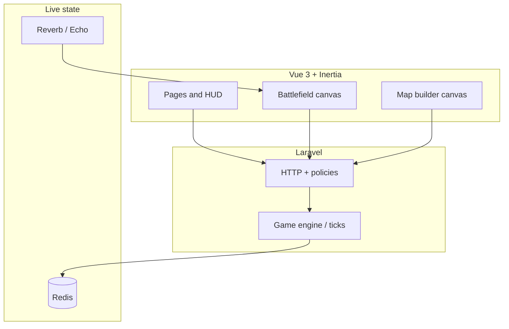

<p align="center">
  
</p>

<h1 align="center">War of Dots</h1>

<p align="center">
  <strong>Plan like a diagram. Fight like an RTS.</strong><br />
  A server-authoritative multiplayer strategy game inspired by
  <a href="https://warofdots.net/">War of Dots</a> — tactical canvas, procedural battlefields,
  and a <strong>Map Builder</strong> you can publish to the community.
</p>

<p align="center">
  <a href="https://laravel.com"></a>
  <a href="https://vuejs.org"></a>
  <a href="https://inertiajs.com"></a>
  <a href="https://tailwindcss.com"></a>
</p>

<p align="center">
  
  
  
  
  
</p>

---

## Terrain gallery

Procedural **Map Builder** generation styles (deterministic previews, same seed). Regenerate anytime with `npm run wiki:map-previews`.

<table>
  <tr>
    <td align="center" width="50%">
      <strong>Mix</strong><br />
      
    </td>
    <td align="center" width="50%">
      <strong>Islands</strong><br />
      
    </td>
  </tr>
  <tr>
    <td align="center">
      <strong>Desert</strong><br />
      
    </td>
    <td align="center">
      <strong>Mountains</strong><br />
      
    </td>
  </tr>
</table>

---

## Why this project

| Pillar | What you get |
|--------|----------------|
| **Visual language** | Flat, diagrammatic battlefields — readable at a glance, inspired by *Historia Civilis*–style maps |
| **Planning loop** | Draw movement and attack paths, commit orders, then resolve — simplified grand-strategy cadence |
| **Fair play** | Game logic on the **Laravel** backend; the Vue canvas is a view, not the source of truth |
| **Community maps** | **Explore** published designs, fork copies into your builder, start lobbies with attribution |

---

## Feature map



- **Lobbies & matches** — create/join games, host flow, match history  
- **Wiki** — in-app specs and rules (`/wiki`)  
- **Map Builder** — vertex terrain grid, markers, undo/redo, random generate, autosave  
- **Explore** — published maps, likes/dislikes, fork to your library, lobby from a map  
- **Icons** — [Lucide](https://lucide.dev) (tree-shaken per view) + [Font Awesome 7](https://fontawesome.com) (global solid/regular/brands)

---

## Stack at a glance

| Layer | Choices |
|-------|---------|
| **Backend** | Laravel 13, WorkOS auth, policies & form requests |
| **Frontend** | Vue 3, Inertia 3, Vite 8, Tailwind CSS 4, Reka UI primitives |
| **State & UX** | Pinia, VueUse, vue-sonner toasts |
| **Realtime** | Laravel Reverb, Echo, Pusher protocol client |
| **Quality** | PHPUnit, Pint, ESLint 9, Prettier 3, Laravel Wayfinder (typed routes) |

---

## Quick start

### Prerequisites

- PHP **8.3+**, [Composer](https://getcomposer.org/)
- Node **22+** and npm  
- [Docker](https://www.docker.com/) (recommended for [Laravel Sail](https://laravel.com/docs/sail))

### Install

```bash
git clone <your-fork-or-remote-url> warofdots
cd warofdots
composer install
cp .env.example .env
php artisan key:generate
```

Configure `.env` (database, `WORKOS_*`, `REDIS_*`, Reverb keys as needed for your environment).

### Run with Sail

```bash
./vendor/bin/sail up -d
./vendor/bin/sail artisan migrate
./vendor/bin/sail npm install
./vendor/bin/sail npm run dev
# optional: ./vendor/bin/sail artisan reverb:start
# optional: ./vendor/bin/sail artisan game:tick --daemon
```

Then open the URL Sail prints (often `http://localhost`).

### Run without Sail

```bash
php artisan migrate
npm install
npm run dev
php artisan serve
```

Use `composer run dev` if your project defines a concurrent dev script.

---

## Useful scripts

| Command | Purpose |
|---------|---------|
| `npm run dev` | Vite dev server + HMR |
| `npm run build` | Production frontend build |
| `npm run wiki:map-previews` | Regenerate wiki terrain SVGs under `public/images/wiki/` |
| `npm run verify:troops` | Sanity-check generated troop layouts |
| `php artisan test --compact` | PHPUnit suite |

---

## Project roots

- **Original game:** [warofdots.net](https://warofdots.net/)  
- **Reference clone (Python):** [gamepycoder/War-of-dots](https://github.com/gamepycoder/War-of-dots)  
- **Visual inspiration:** [Historia Civilis](https://www.youtube.com/c/HistoriaCivilis) (diagram-style battles)

---

## License

This repository is **free to read, fork, modify, and share**, but **not for commercial use or private monetary gain** (including running paid services, selling hosting, or otherwise monetizing a derivative as a product).

The legal terms are the [**PolyForm Noncommercial License 1.0.0**](LICENSE) ([summary](https://polyformproject.org/licenses/noncommercial/1.0.0/)). That keeps the codebase open while barring others from **making money off forks** without a separate agreement from the copyright holders.

> **Note:** The [Open Source Initiative](https://opensource.org/osd) definition of “open source” *includes* the right to use software commercially. So this project is best described as **source-available** or **non-commercial open**, not OSI “Open Source™”. If you need a commercial license, contact the maintainers.
