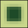
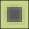
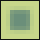
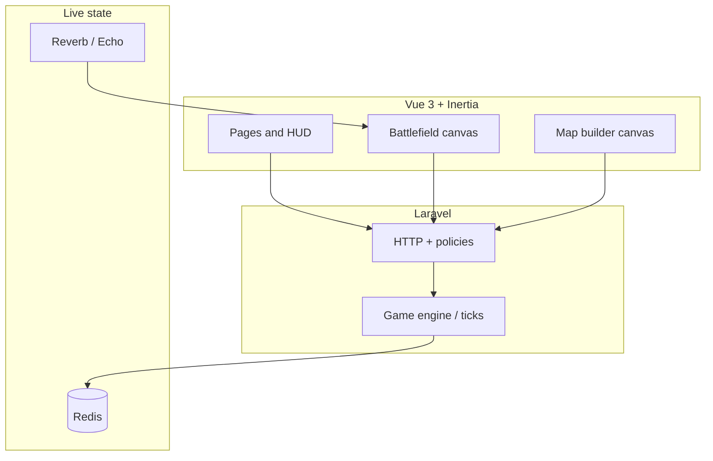

<p align="center">
  
</p>

<h1 align="center">Clash of Dots</h1>

<p align="center">
  <strong>Plan like a diagram. Fight like an RTS.</strong><br />
  <strong>Clash of Dots</strong> is a server-authoritative multiplayer strategy game - tactical canvas,
  procedural battlefields, and a <strong>Map Builder</strong> you can publish to the community. Gameplay
  is inspired by the classic browser RTS
  <a href="https://warofdots.net/">War of Dots</a>.
</p>

<p align="center">
  <a href="https://github.com/tmwclaxton/clashofdots"></a>
  <a href="https://laravel.com"></a>
  <a href="https://vuejs.org"></a>
  <a href="https://inertiajs.com"></a>
  <a href="https://tailwindcss.com"></a>
</p>

<p align="center">
  
  
  
  
  
</p>

---

## Game Wiki

The in-app **Game Wiki** (`/wiki`) is the live reference for balance and map rules. Every number on the page is served from **`App\Game\GameSpecs`** on the backend—the same source the engine and Map Builder draw from, not hand-maintained copy in Vue.

| Section | What it covers |
|--------|----------------|
| **Combat units** | Infantry vs tank—health, recruit cost, upkeep, defense, and role summaries |
| **Settlements & economy** | Capitals and outposts (income, supply caps, healing), plus economy notes on income, upkeep, supply, recruitment, and encirclement |
| **Terrain types** | All 12 editor terrains with color swatches, infantry/tank speed & attack stats, and tactical notes |
| **Map generation styles** | Mixed, Islands, Desert, and Mountains—traits, descriptions, and deterministic preview renders |

Open the wiki from the landing page header, the app top bar, or directly at `/wiki` once the app is running. The Map Builder card at the top links straight into authoring.

Wiki and README preview images live under `public/images/wiki/` (terrain swatches and map-generation renders) and can be regenerated with `npm run wiki:map-previews`.

### Terrain palette

Twelve brush types paint the vertex grid in the Map Builder and appear on the wiki terrain table. Swatches match the in-game editor colors.

<div align="center">

<table>
  <tr>
    <td align="center" width="25%">
      <br />
      <strong>Plains</strong><br />
      <sub>Open grassland</sub>
    </td>
    <td align="center" width="25%">
      <br />
      <strong>Meadow</strong><br />
      <sub>Soft rolling grass</sub>
    </td>
    <td align="center" width="25%">
      <br />
      <strong>Forest</strong><br />
      <sub>Light woodland</sub>
    </td>
    <td align="center" width="25%">
      <br />
      <strong>Dense forest</strong><br />
      <sub>Thick woodland</sub>
    </td>
  </tr>
  <tr>
    <td align="center">
      <br />
      <strong>Hill</strong><br />
      <sub>High ground</sub>
    </td>
    <td align="center">
      <br />
      <strong>Mountain</strong><br />
      <sub>Impassable</sub>
    </td>
    <td align="center">
      <br />
      <strong>Desert</strong><br />
      <sub>Tank-friendly dunes</sub>
    </td>
    <td align="center">
      <br />
      <strong>Beach</strong><br />
      <sub>Coastal sand</sub>
    </td>
  </tr>
  <tr>
    <td align="center">
      <br />
      <strong>Water</strong><br />
      <sub>Shallow · damage over time</sub>
    </td>
    <td align="center">
      <br />
      <strong>Deep water</strong><br />
      <sub>Ocean · heavy penalties</sub>
    </td>
    <td align="center">
      <br />
      <strong>River</strong><br />
      <sub>Narrow chokepoints</sub>
    </td>
    <td align="center">
      <br />
      <strong>Swamp</strong><br />
      <sub>Boggy wetland</sub>
    </td>
  </tr>
</table>

</div>

Infantry generally keeps speed in forests and hills; tanks excel on plains, desert, and beach but bog down in woodland and water. Full speed, attack, and defense multipliers for every tile are on the wiki terrain table.

### Map generation previews

Procedural **Map Builder** styles (deterministic previews, same seed). These match the **Map generation styles** section on the wiki.

<table>
  <tr>
    <td align="center" width="50%">
      <strong>Mix</strong><br />
      
    </td>
    <td align="center" width="50%">
      <strong>Islands</strong><br />
      
    </td>
  </tr>
  <tr>
    <td align="center">
      <strong>Desert</strong><br />
      
    </td>
    <td align="center">
      <strong>Mountains</strong><br />
      
    </td>
  </tr>
</table>

---

## Why this project

| Pillar | What you get |
|--------|----------------|
| **Visual language** | Flat, diagrammatic battlefields - readable at a glance, inspired by *Historia Civilis*–style maps |
| **Planning loop** | Draw movement and attack paths, commit orders, then resolve - simplified grand-strategy cadence |
| **Fair play** | Game logic on the **Laravel** backend; the Vue canvas is a view, not the source of truth |
| **Community maps** | **Explore** published designs, fork copies into your builder, start lobbies with attribution |

---

## Feature map



- **Lobbies & matches** - create/join games, host flow, match history  
- **Wiki** - live unit, terrain, economy, and map-generation specs at `/wiki` (backed by `GameSpecs`)  
- **Map Builder** - vertex terrain grid, markers, undo/redo, random generate, autosave  
- **Explore** - published maps, likes/dislikes, fork to your library, lobby from a map  
- **Icons** - [Lucide](https://lucide.dev) (tree-shaken per view) + [Font Awesome 7](https://fontawesome.com) (global solid/regular/brands)

---

## Stack at a glance

| Layer | Choices |
|-------|---------|
| **Backend** | Laravel 13, WorkOS auth, policies & form requests |
| **Frontend** | Vue 3, Inertia 3, Vite 8, Tailwind CSS 4, Reka UI primitives |
| **State & UX** | Pinia, VueUse, vue-sonner toasts |
| **Realtime** | Laravel Reverb, Echo, Pusher protocol client |
| **Quality** | PHPUnit, Pint, ESLint 9, Prettier 3, Laravel Wayfinder (typed routes) |

---

## Quick start

### Prerequisites

- PHP **8.3+**, [Composer](https://getcomposer.org/)
- Node **22+** and npm  
- [Redis](https://redis.io/) (live match state; required for lobbies and matches)
- [Docker](https://www.docker.com/) (recommended for [Laravel Sail](https://laravel.com/docs/sail))

### Install

```bash
git clone https://github.com/tmwclaxton/clashofdots.git
cd clashofdots
composer install
cp .env.example .env
php artisan key:generate
```

Configure `.env` (database, `WORKOS_*`, `REDIS_*`, and `REVERB_*` / `VITE_REVERB_*` for WebSockets). Matches need **Redis** plus **Reverb** and the **game tick** worker so the battlefield simulates and broadcasts state.

### Run with Sail

```bash
./vendor/bin/sail up -d
./vendor/bin/sail artisan migrate
./vendor/bin/sail npm install
./vendor/bin/sail npm run dev
```

Sail’s [`compose.yaml`](compose.yaml) already runs **Reverb** and **`php artisan game:tick --daemon`** as separate services, so you do not need to start them manually when using Sail.

Then open the URL Sail prints (often `http://localhost`).

### Run without Sail

```bash
php artisan migrate
npm install
composer run dev
```

`composer run dev` runs the HTTP server, queue worker, logs, Vite, **Reverb**, and **`game:tick --daemon`** together. Ensure **Redis** is running and `REDIS_*` in `.env` points at it.

If you prefer to run pieces yourself:

```bash
php artisan serve
npm run dev
php artisan reverb:start
php artisan game:tick --daemon
```

---

## Production deploy

CI builds the **`Dockerfile`**, pushes **`ghcr.io/<lowercase github.repository>:latest`**, then SSHs to your host, uploads **`compose.prod.yaml`** into `DEPLOY_DIR`, and runs **`docker compose pull`**, **`up -d`**, and **`php artisan migrate --force`**. SSH uses **Cloudflare Access** (`cloudflared access ssh`) when `CF_ACCESS_CLIENT_*` secrets are set.

### Shared host: only clashofdots

The workflow and compose file are scoped to **project name `clashofdots`** and **`DEPLOY_DIR`** only. It does **not** run host-wide `docker prune` or other commands that would affect other stacks.

When operating manually on a server that runs multiple apps:

- Work only under your **`DEPLOY_DIR`** (e.g. `/opt/clashofdots`).
- Always pass **`-p clashofdots`** and **`-f compose.prod.yaml`** (and **`--env-file .env`**) so Docker Compose never touches another project’s containers or volumes.
- Do not run **`docker volume prune`**, **`docker image prune -a`**, or **`docker system prune`** unless you intend to clean **the whole host**; prefer removing only compose-managed resources for this stack after **`docker compose -p clashofdots … down`**, and only volumes whose names you recognize as belonging to this project.

### Flow

1. **Triggers:** push to `main` or **Actions → Production Deploy → Run workflow**.
2. **Build:** checkout → login to GHCR → `docker build` → `docker push`.
3. **Deploy:** `cloudflared` → SSH key + config (including `ProxyCommand` when using Access) → upload `compose.prod.yaml` → remote `docker login`, `compose pull`, `up -d`, `migrate`.

### Deploy target: **Secrets** or **Variables**

Use **either** the **Secrets** tab **or** the **Variables** tab for `DEPLOY_HOST`, `DEPLOY_USER`, and `DEPLOY_DIR`. If both are set for the same name, the **Secret** value wins.

| Name | Example | Purpose |
|------|---------|---------|
| `DEPLOY_HOST` | `ssh.example.com` | SSH hostname. |
| `DEPLOY_USER` | `deploy` | SSH user. |
| `DEPLOY_DIR` | `/opt/clashofdots` | Remote directory with `.env` and `compose.prod.yaml`. |

Non-sensitive values are fine as **Variables**; using **Secrets** (as in your screenshot) is also valid.

### Other repository **Secrets**

| Secret | Purpose |
|--------|---------|
| `DEPLOY_SSH_PRIVATE_KEY` | Private key for `DEPLOY_USER` on `DEPLOY_HOST`. |
| `CF_ACCESS_CLIENT_ID` / `CF_ACCESS_CLIENT_SECRET` | Optional: Cloudflare Access service token for `cloudflared access ssh`. Omit only if you use plain SSH without Access. |
| `GHCR_TOKEN` | PAT with `read:packages` so the server can **`docker login ghcr.io`** and pull the app image. |

Workflow: [`.github/workflows/prod_deploy.yml`](.github/workflows/prod_deploy.yml).

### One-time server prep

```bash
ssh YOUR_USER@YOUR_HOST
sudo mkdir -p /opt/clashofdots    # same path as DEPLOY_DIR; skip if it already exists
sudo chown YOUR_USER:YOUR_USER /opt/clashofdots
cd /opt/clashofdots
cp /path/to/.env.example .env     # edit: APP_URL, DB_*, WorkOS, Redis, Reverb, etc.
```

The deploy job **does not** create `DEPLOY_DIR`; it only writes `compose.prod.yaml` there. The directory must exist and be writable by `DEPLOY_USER`.

Production `.env` should use **`DB_CONNECTION=pgsql`**, **`DB_HOST=pgsql`**, **`REDIS_HOST=redis`** to match `compose.prod.yaml`. The app is exposed on the host as **`8091` → container `80`**; change the port mapping in `compose.prod.yaml` if it conflicts with other stacks.

### After deploy

Point DNS or a reverse proxy at the host port you mapped (default **8091**), or add Reverb/queue services to `compose.prod.yaml` when you need them.

---

## Useful scripts

| Command | Purpose |
|---------|---------|
| `npm run dev` | Vite dev server + HMR |
| `npm run build` | Production frontend build |
| `npm run wiki:map-previews` | Regenerate wiki/README preview SVGs under `public/images/wiki/` |
| `npm run verify:troops` | Sanity-check generated troop layouts |
| `php artisan test --compact` | PHPUnit suite |

---

## Project roots

- **Original game:** [warofdots.net](https://warofdots.net/)  
- **Reference clone (Python):** [gamepycoder/War-of-dots](https://github.com/gamepycoder/War-of-dots)  
- **Visual inspiration:** [Historia Civilis](https://www.youtube.com/c/HistoriaCivilis) (diagram-style battles)

---

## License

This repository is **free to read, fork, modify, and share**, but **not for commercial use or private monetary gain** (including running paid services, selling hosting, or otherwise monetizing a derivative as a product).

The legal terms are the [**PolyForm Noncommercial License 1.0.0**](LICENSE) ([summary](https://polyformproject.org/licenses/noncommercial/1.0.0/)). That keeps the codebase open while barring others from **making money off forks** without a separate agreement from the copyright holders.

> **Note:** The [Open Source Initiative](https://opensource.org/osd) definition of “open source” *includes* the right to use software commercially. So this project is best described as **source-available** or **non-commercial open**, not OSI “Open Source™”. If you need a commercial license, contact the maintainers.
